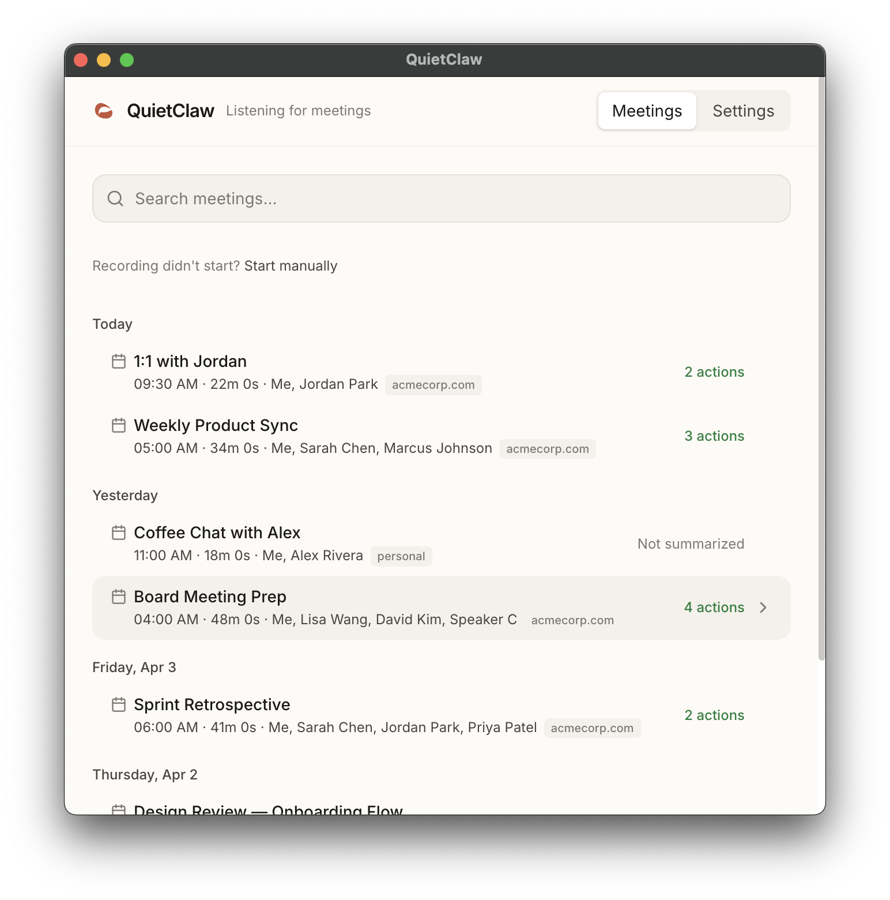

# QuietClaw

[](https://github.com/laszlokorsos/quietclaw/actions/workflows/ci.yml)
[](LICENSE)
[](package.json)

**Like [Granola](https://granola.ai), but open source.**

Silent meeting capture for macOS: auto-records your video calls (Zoom, Meet, Teams), transcribes with speaker attribution, writes structured notes + action items to plain files on disk. No bot joins the call. No virtual audio device. No backend account. Your LLM key, your prompt, your data — local by default. Any agent that can read a file can consume meeting context.

<p align="center">
  
</p>

## Why QuietClaw

| | |
|---|---|
| **Structured JSON output** | Not just a pretty transcript UI — machine-readable data agents can consume |
| **Plain files on disk** | Claude Code, OpenClaw, or any agent reads `~/.quietclaw/meetings/` directly — no API, no setup |
| **Open source** | Apache 2.0, no vendor lock-in, extend it however you want |
| **No meeting bot** | Captures audio directly via macOS Core Audio Taps, invisible to other participants |
| **Real-time transcription** | Deepgram gives you streaming STT with built-in speaker diarization — bring your own API key, pay pennies per minute |
| **Optional AI summarization** | Claude extracts executive summaries, decisions, and action items — or skip it and let your agents process the raw transcript however they want |

## How It Works

```
Call detected (or started manually)
  → Audio capture runs in isolated utility process (no UI jank)
  → Mic + system audio sent as two mono streams to Deepgram
  → Speaker diarization separates participants on system channel
  → Calendar matcher names speakers from attendee list
Call ends
  → Transcript assembled with speaker attribution
  → Optional: Claude summarization → summary + action items
  → Files written to ~/.quietclaw/meetings/YYYY-MM-DD/{slug}/
  → Indexed in SQLite, your agents can now act on it
```

## Quick Start

### Prerequisites

- **macOS 13+** (Ventura or later — required for Core Audio Taps)
- **Node.js 20+** and **pnpm**
- **Xcode Command Line Tools** (`xcode-select --install`)

### Install & Run

```bash
git clone https://github.com/laszlokorsos/quietclaw.git
cd quietclaw
pnpm install
pnpm run build:native    # Build the native Core Audio addon
pnpm build               # Build the app + package as DMG
```

The built `.dmg` is in `dist/`. Open it, drag QuietClaw to Applications, and launch. It runs as a menu bar app — look for the icon in your top bar.

On first launch, macOS will prompt for **Screen Recording** permission (required for audio taps).

> **Developer mode:** If you want to hack on QuietClaw instead, run `pnpm dev` for hot-reloading dev mode.

### API Keys

| Key | Required | Purpose |
|-----|----------|---------|
| **Deepgram** | Yes | Real-time speech-to-text (~$0.0043/min) |
| **Anthropic** | No | AI summarization (Claude Haiku) |

Add keys via the Settings panel in the app, or set `DEEPGRAM_API_KEY` / `ANTHROPIC_API_KEY` environment variables for development.

### Calendar

Click **Settings > Google Calendar > Connect Account** to add one or more Google accounts. The app handles OAuth automatically — no GCP setup required from you.

## Agent Integration

QuietClaw writes plain files to disk — no API server, no MCP, no integration layer. Claude Code, OpenClaw, or any agent that can read files consumes meeting data directly.

**Drop-in agent skill:** the repo ships a [`SKILL.md`](SKILL.md) that documents the on-disk layout, schema, and common query patterns as a reusable skill. Point Claude Code (or any agent framework with skill auto-discovery) at it and the agent learns how to answer "what were today's meetings", "what are my open action items", "what did I decide about X" without being told where anything lives.

```bash
# Today's meetings
ls ~/.quietclaw/meetings/$(date +%Y-%m-%d)/

# Read a transcript (JSON for parsing, Markdown for reading)
cat ~/.quietclaw/meetings/2026-04-05/weekly-standup-a1b2/transcript.json
cat ~/.quietclaw/meetings/2026-04-05/weekly-standup-a1b2/transcript.md

# Action items
cat ~/.quietclaw/meetings/2026-04-05/weekly-standup-a1b2/actions.json

# Daily index lists all meetings for a date
cat ~/.quietclaw/meetings/2026-04-05/index.md
```

Each meeting directory contains `metadata.json`, `transcript.json`, and optionally `summary.json` and `actions.json`. The Markdown files are the same data in human/LLM-readable format with YAML frontmatter. Full schema and richer query examples in [`SKILL.md`](SKILL.md).

## Output Format

Each meeting produces a directory under `~/.quietclaw/meetings/`:

```
2026-04-04/
  index.md                # Daily index with links to all meetings
  weekly-standup-a1b2/
    metadata.json         # Meeting metadata, speakers, calendar event
    transcript.json       # Timestamped, speaker-attributed segments
    transcript.md         # Human-readable transcript with YAML frontmatter
    summary.json          # Executive summary, topics, decisions (if summarized)
    summary.md            # Human-readable summary with YAML frontmatter
    actions.json          # Action items with assignees and priority
```

Files are plain JSON and Markdown — readable by any tool, diffable in git, and queryable with `jq`. See [`examples/`](examples/) for complete sample output.

### Obsidian & Knowledge Graph Compatible

All markdown files include YAML frontmatter with structured metadata. Speaker names are rendered as wikilinks (`[[Jordan]]`). Point an Obsidian vault at `~/.quietclaw/meetings/` and your meetings become part of your knowledge graph — Dataview queries, backlinks, graph view all work out of the box.

## Features

- **Silent audio capture** via Core Audio Taps (mic + system audio, no virtual device)
- **Auto-detection** of Google Meet, Zoom, and Teams calls via window title and mic activity
- **Real-time transcription** via Deepgram with multi-speaker diarization
- **Speaker identification** — mic audio is always "you"; system audio speakers separated by diarization; 2-person calls fully named via calendar; 3+ person calls support manual speaker mapping
- **Google Calendar integration** — multi-account OAuth, automatic event matching, attendee extraction
- **Optional AI summarization** — executive summary, topics, decisions, action items
- **Structured output** — JSON + Markdown files per meeting, indexed in SQLite
- **Crash recovery** — orphaned recordings automatically recovered on next launch
- **Platform join buttons** — upcoming meetings show clickable Google Meet / Zoom / Teams buttons
- **Obsidian-compatible** — YAML frontmatter, wikilinks, daily index files

## Configuration

QuietClaw uses a TOML config file at `~/.quietclaw/config.toml`. Key settings:

```toml
[general]
data_dir = "~/.quietclaw/meetings"    # Where meetings are stored

[stt]
provider = "deepgram"                 # STT provider (deepgram is the default)

[stt.deepgram]
model = "nova-3"                      # Deepgram model
language = "en"
diarize = true                        # Multi-speaker separation

[summarization]
enabled = true                        # Set false to skip summarization
provider = "anthropic"
model = "claude-haiku-4-5-20251001"

```

See [`resources/default_config.toml`](resources/default_config.toml) for all options.

## Roadmap

### Phase 2: People & Intelligence
- **Contacts database** — persistent people across meetings, email-to-name mapping, so agents can query "all meetings with Alice"
- **Speaker consistency** — autocomplete from past names, stable wikilinks across meetings
- **Cross-meeting queries** — "all meetings with person X", "open actions for team Y"
- **Voice fingerprint learning** — automatic speaker recognition that improves from manual corrections
- **Meeting type templates** — different summarization prompts for standups, 1:1s, all-hands

### Phase 3: Platform
- **Microsoft/Outlook calendar** — enterprise calendar support via Graph API
- **Windows support** — WASAPI loopback capture (architecture is already abstracted behind `AudioCaptureProvider`)
- **Webhooks** — push meeting data to n8n, Zapier, or custom endpoints when processing completes
- **Multi-language** — transcription and summarization in non-English languages

## Development

```bash
pnpm dev          # Dev mode with hot reload
pnpm test         # Run vitest
pnpm typecheck    # TypeScript strict mode check
pnpm build        # Full production build (vite + electron-builder)
```

See [`CLAUDE.md`](CLAUDE.md) for the full development guide — architecture, coding standards, how to add new providers.

## Tech Stack

| Layer | Technology |
|-------|-----------|
| App framework | Electron (TypeScript) |
| Audio capture | macOS Core Audio Taps (native N-API addon) |
| STT | Deepgram (real-time WebSocket streaming) |
| Summarization | Anthropic Claude (Haiku default) |
| Calendar | Google Calendar API (OAuth) |
| Database | better-sqlite3 |
| UI | React 19 + Tailwind CSS |
| Config | TOML (`~/.quietclaw/config.toml`) |
| Secrets | Electron safeStorage (OS-level encryption) |

## Contributing

Contributions are welcome! See [CONTRIBUTING.md](CONTRIBUTING.md) for setup instructions and the PR process.

For security vulnerabilities, see [SECURITY.md](SECURITY.md) — do not open a public issue.

## Recording & Consent

QuietClaw records audio from your meetings. Recording laws vary by jurisdiction — some require only one party's consent, others require all participants. **It is your responsibility to understand and comply with the recording laws that apply to you.**

## License

[Apache 2.0](LICENSE)
